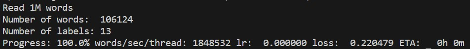
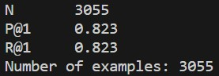

# Repositorio de Web Semántica (minería)
###### Laura Delgado Álvarez

# Descripción
En este repositorio se encuentran una serie de ejercicios que permitirán el desarrollo y la validación de un clasificador de noticias relacionadas con el cambio climático.<br>
La colección de noticias sobre la que se realizarán los ejercicios es 'noticias.ndjson'<br>

## Requisitos iniciales
Para la ejecución de los fragmentos de código será necesario que tengas instalado Python (se utilizó la versión 3.9) y las dependencias simhash, textacy, spacy y nltk. <br>

En concreto será necesaria la ejecución de los siguientes comandos.
- Ejercicio 1: 
    - pip install simhash
    - pip install textacy
- Ejercicio 2: 
    - pip install spacy
    - python -m spacy download es_core_news_sm
    - pip install nltk
<br>

## Empezando
En la carpeta sobre la que vayas a realizar los ejercicios copia el archivo 'noticias.ndjson'.<br>
<strong>Atención: </strong> Es importante que sigas el nombrado de archivos y carpetas para que los scripts se ejecuten de forma adecuada. En caso contrario, deberás ir corrigiendo las rutas de los scripts.<br><br>

# Ejecución
## Ejercicio 1
En este ejercicio se seleccionarán las noticias no negacionistas y se eliminarán los documentos cuasi-duplicados.<br>
Para ello, crea una carpeta 'ejercicio1' en la carpeta sobre la que realizas los ejercicios, incorpora a ella el archivo 'eliminar_cuasi_duplicados.py' y abre una terminal de línea de comandos para realizar las siguientes instalaciones.<br>
```bash
pip install simhash
pip install textacy
``` 
<br>
Si ejecutas el archivo 'eliminar_cuasi_duplicados.py', se generará el fichero 'noticias_sin_cuasi_duplicados.ndjson', que habrá obtenido las noticias no negacionistas sin cuasiduplicados a partir de la colección original. [La ejecución puede tardar unos 2 minutos]<br><br>

## Ejercicio 2
En este ejercicio se granularán las noticias obtenidas en el ejercio anterior en segmentos temáticamente coherentes.<br>
Para ello, crea una carpeta 'ejercicio2' en la carpeta sobre la que realizas los ejercicios, incorpora a ella el archivo 'segmentacion.py' y realiza las siguientes instalaciones.<br>
```bash
pip install spacy
python -m spacy download es_core_news_sm
pip install nltk
``` 
<br>
Si ejecutas el archivo 'segmentacion.py', se generarán los ficheros 'noticias_segmentadas.txt', que habrá guardado los diferentes segmentos de cada noticia, y 'noticias_segmentadas_vinculadas.txt', que por cada noticia asocia el identificador con la posición inicial y final (número de línea) de los segmentos de 'noticias_segmentadas.txt', de modo que podemos identificar a qué noticia pertenece cada segmento.<strong> [La ejecución puede tardar unos 15 minutos]</strong><br><br>

## Ejercicio 3
En este ejercicio se aplicará clustering con k-means a los segmentos obtenidos en el ejercicio anterior.<br>
Para ello, crea una carpeta 'ejercicio3' en la carpeta sobre la que realizas los ejercicios e incorpora a ella el archivo 'clustering.py'.
<br>
Si ejecutas el archivo 'clustering.py', se generarán los ficheros 'clusters.txt', que mostrará 25 clústers con unas keywords y un pequeño fragmento de 5 noticias que pertenecen al clúster, y 'clusters_pickle', que es un archivo binario que almacena el contenido completo de los diferentes clusters.<br><br>

## Ejercicio 4
En este ejercicio se realizará de forma manual la selección y etiquetado de los clústers más prometedores a partir de los clústers obtenidos en el ejercicio anterior.<br>
Para ello, crea una carpeta 'ejercicio4' en la carpeta sobre la que realizas los ejercicios e incorpora a ella un archivo 'seleccion_manual_clusters.txt' donde selecciones los clústers que te parecen más interesantes y les pongas una etiqueta breve.
<br>
El nombrado o formato del archivo que desarrolles en este punto es irrelevante, ya que su contenido se tendrá que modificar en los siguientes scripts de forma manual.<br><br>

## Ejercicio 5
En este ejercicio se generará un conjunto de entrenamiento y otro de test a partir de los clústers etiquetados entre los ejercicios 3 y 4, para el desarrollo del clasificador.<br>
Para ello, crea una carpeta 'ejercicio5' en la carpeta sobre la que realizas los ejercicios e incorpora a ella el archivo 'conjuntos_entrenamiento_testing.py'.
<br>
Si ejecutas el archivo 'conjuntos_entrenamiento_testing.py', se generarán los ficheros 'entrenamiento.txt', que contendrá los segmentos etiquetados que se destinarán al entrenamiento del clasificador (80%), y 'testing.txt', que contendrá los segmentos etiquetados que se destinarán a la validación del clasificador (20%).<br><br>

En mi caso, se trabajó con 11837 segmentos etiquetados y 3404 segmentos considerados offtopic (noticias de pago, temas no relacionados con el cambio climático, redes sociales...), de modo que los segmentos etiquetados son 3.5 veces los offtopic.<br>
De estos segmentos, se obtuvieron un 79.96% para realizar el entrenamiento del clasificador (12186 segmentos) y un 20.04% para su validación (3055 segmentos).
<br><br>

## Ejercicio 6
En este ejercicio se entrenará un clasificador a partir de los archivos generados en el ejercicio anterior.<br>
Para ello, crea una carpeta 'ejercicio6' en la carpeta sobre la que realizas los ejercicios e incorpora a ella la carpeta 'fasttext' con todos sus contenidos.
<br>
Abre una terminal de línea de comandos en la carpeta 'ejercicio6' y ejecuta las siguientes instrucciones.<br>

```bash
./fasttext/fasttext.exe supervised -input ../ejercicio5/entrenamiento.txt -output ./modelo -epoch 80 
``` 
<br>

<br><br>

En este punto se habrán generado los ficheros 'modelo.bin' y 'modelo.vec'. El primero nos servirá para hacer la validación del clasificador.<br>

```bash
./fasttext/fasttext.exe test ./modelo.bin ../ejercicio5/testing.txt
``` 
<br>

<br><br>
En mi caso, el clasificador tiene una precisión del 82.3%.<br><br>

## Ejercicio 8
En este ejercicio se evaluará el clasificador contra la colección de noticias negacionistas del cambio climático.<br>
Para ello, crea una carpeta 'ejercicio8' en la carpeta sobre la que realizas los ejercicios e incorpora a ella el archivo 'tratamiento_otra_coleccion.py' y las carpetas <strong>vacías</strong> 'etiquetado_manual', 'fasttext' y 'tratamiento'.<br>
<br>
Si ejecutas el archivo 'tratamiento_otra_coleccion.py', en la carpeta 'tratamiento' se generarán los ficheros 'segmentos_negacionistas_a_predecir.txt', que habrá guardado los diferentes segmentos de cada noticia, y 'vinculo_noticias_segmentos_negacionistas.txt', que por cada noticia incorpora la posición inicial y final (número de línea) de los segmentos de 'noticias_segmentadas.txt', de modo que podemos identificar a qué noticia pertenece cada segmento. [La ejecución puede tardar unos 2 minutos]<br><br>

Abre una terminal de línea de comandos en la carpeta 'ejercicio8' y ejecuta la siguiente instrucción, que generará el archivo 'segmentos_negacionistas_tematicas_fasttext.txt' en la carpeta 'fasttext' y que contendrá las etiquetas de cada segmento obtenido en el paso anterior.<br>
```bash
../ejercicio6/fasttext/fasttext.exe  predict ../ejercicio6/modelo.bin ./tratamiento/segmentos_negacionistas_a_predecir.txt > ./fasttext/segmentos_negacionistas_tematicas_fasttext.txt
``` 
<br>

Ahora incopora el archivo 'resultados_fasttext.txt' a la carpeta 'ejercicio8'. Si lo ejecutas, se generará el fichero 'noticias_negacionistas_etiquetadas.ndjson', que almacenará cada noticia con un apartado con las etiquetas generadas previamente por fasttext.<br><br>

A continuación, incluye el archivo 'noticias_etiquetado_manual.py' a la carpeta 'ejercicio8'. Si lo ejecutas, se generarán en la carpeta 'etiquetado_manual' los ficheros 'noticias_seleccionadas.txt' con 10 noticias seleccionadas aleatoriamente para evaluar el clasificador y 'noticias_a_etiquetar.txt', que contiene el título y el contenido de cada noticia para su evaluación manual.<br>

En este punto, deberás crear en la carpeta 'etiquetado_manual' un archivo 'etiquetado_manual.txt' <strong> siguiendo el formato dado</strong> (copiar las 3 primeras líneas del ejemplo 'etiquetado_manual.txt' y por cada noticia, copiar el título generado en 'noticias_a_etiquetar.txt' y en una nueva línea poner cada etiqueta en minúsculas, separadas por un espacio).<br><br>

Finalmente, incorpora el archivo 'evaluador_precision.py' a la carpeta 'ejercicio8'. Si lo ejecutas, se generará el fichero 'precision_clasificador.txt' con la precisión del clasificador de forma total y por etiqueta.<br>
En mi caso, el clasificador tiene una precisión del 47.75%, es decir, obtiene unos resultados un 34.55% peores que con la colección con la que fue entrenado.